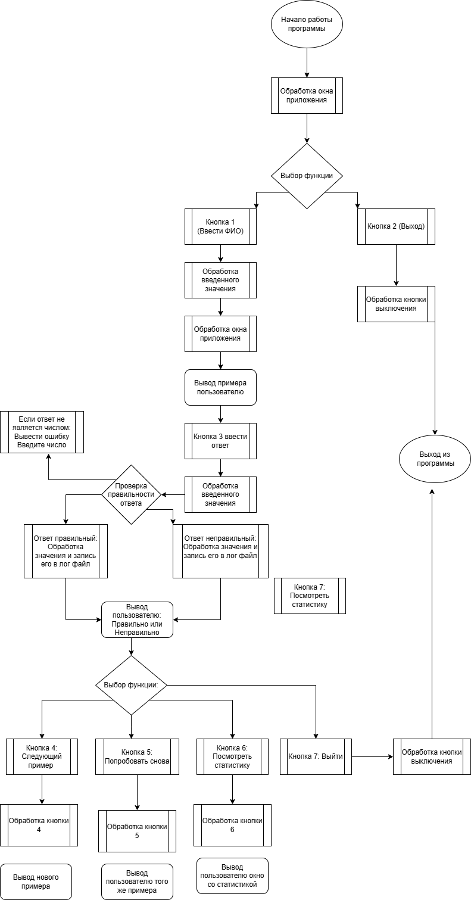

# MathMaster
MathMaster помогает выучить и закрепить знание таблицы умножения. Программа генерирует примеры, проверяет ответы, ведет статистику успехов и сохраняет историю решений в лог-файл.

## Цели ##
Создать удобное приложение для изучения и закрепления таблицы умножения. MathMaster нужен чтобы помочь школьникам младших классов быстро научиться умножать числа от 2 до 9 с помощью интерактивных упражнений и системы отслеживания прогресса.

## Задачи ##
1. Пользовательский интерфейс и авторизация:

· Разработать несколько окон приложения для навигации: главное меню, окно входа/регистрации пользователя и окно статистики.
· Реализовать систему простой авторизации для разделения пользователей и ведения персональной статистики успехов.

2. Основной игровой процесс:

· Обеспечить генерацию случайных примеров на умножение с множителями в диапазоне от 2 до 9.
· Создать специальное окно для ввода ответа пользователем на текущий пример.

3. Отслеживание прогресса и логирование:

· Собирать и хранить статистику успехов каждого пользователя (количество решенных примеров, количество правильных ответов).
· Реализовать окно вывода статистики для наглядного отображения прогресса.
· Настроить автоматическое сохранение всех решенных примеров и действий пользователя в текстовый лог-файл для возможности последующего анализа.
## Описание ##

* Главное окно, окно входа, окно статистики.
* Решение случайных примеров на умножение (от 2 до 9).
* Окно ввода ответа на пример.
* Кнопки проверки, перехода к следующему примеру, сброса статистики.

## Функционал ##

* Просмотр своей статистики за текущую сессию (сколько решено, сколько ошибок).
* Профили учеников сохраняются в словаре.
* Просмотр полного лога действий всех учеников.

## Блок-схема алгоритма

## Use Case диаграмма

